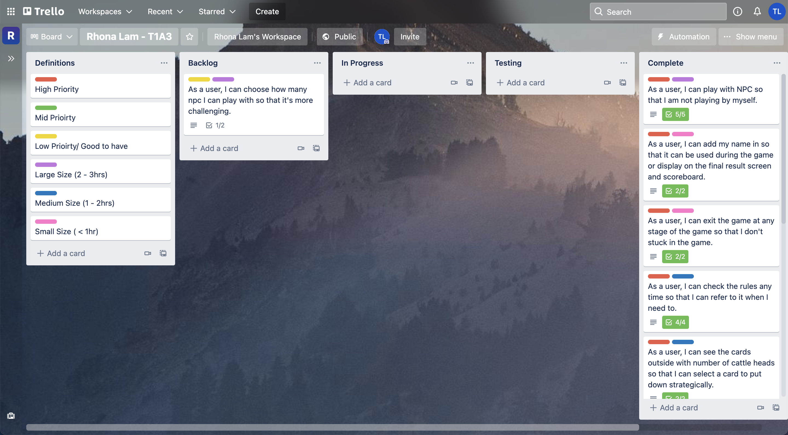
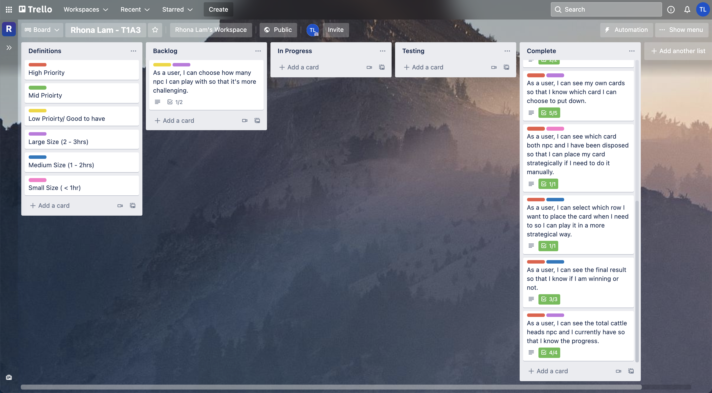
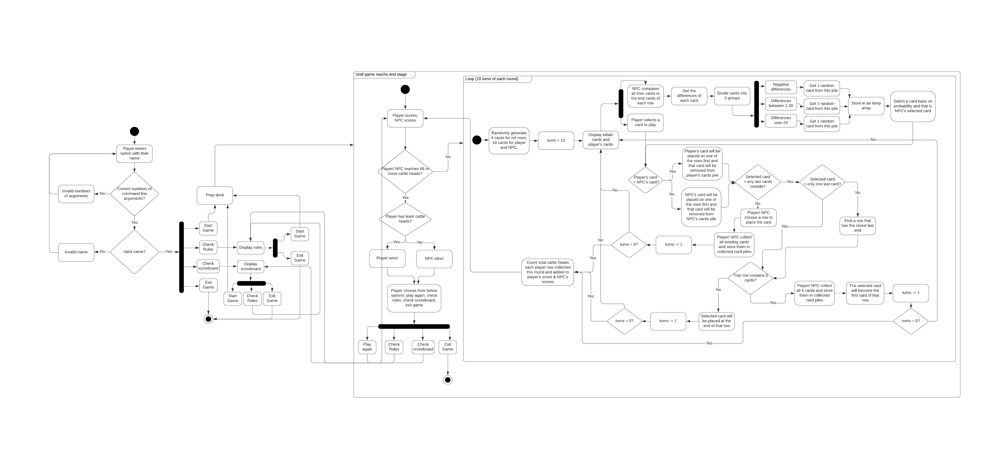

# Tan Na Lam - T1A3 - Terminal Application: 6 Nimmt!

# Links

## GitHub repository

https://github.com/rhonaCA/T1A3 

## Trello board

https://trello.com/b/9B8uQP3L/rhona-lam-t1a3




# Software development Plan

## Application description and function
This terminal application is a clone of a card game called 6 Nimmt! 6 Nimmt! / Take 6! Is a card game for 2 - 10 players designed by Wolfgang Kramer in 1994. Suitable for 8 years or up and playing time can be vary, around 15 to 45 minutes depends on the numbers of player. This game is easy to play and can be quite challenging to win.

This game has 104 cards, each contains a number and 1 to 7 cattle heads icons that represent penalty points. Each round has 10 turns, each turn all players place one card of their choice out. The placed cards are placed on one of four rows according to the fixed rules. If the card needs to be placed onto a row that already has five cards which classified as a full row according to the rules. Then the player who place that card needs to collect those five cards, which count as penalty points that are totalled up at the end of each round. Game will continue until a player collects 66 cattle heads or more, the player with the least cattle heads wins the game.

## Reason for development

I want to create something that is fun and interesting to use or play. As I will spend quite a bit of times on this application, I want the process is enjoyable. And I would be more likely to have motivation to make it better. Also, this game is one of my families' favourite card game, I want to make an application for them so they can play at their leisure. 

## Problem solved
As I said before, one of the reason I choose this card game as my idea of the application is because I want my families can play it and enjoy it. I do not know when the international travel will be re-opened due to the current pandemic, so I hope this application can bring some joy to them and hopefully they can think of me during the game.

## Target audience
Apart my families and friends. I want anyone who loves board games or card games to enjoy it. For first time players, it may be a bit confused at first, but I guarantee you will get a hang of it after a few rounds.  

## How to play

### **Goal of the game**
---
Try not to get any cards as it will add up the penalty points.


### **Gameplay**
---
Hi player, you are playing with 1 NPC in this game. Both of you will have 10 cards to start with each round. You will see 4 initial set up cards placed vertically on the screen and your own cards that have be arranged in ascending order. 

At each turn, you can select a card to play by using ↑ / ↓ keys. After you select a card, depend whose card is smaller (you or NPC), that player will first put their card at the end of one of the 4 rows base on below rules:

### **- Rule No. 1: Ascending Order**

The number of the card that is added to a row must be higher than the number of the current last card in that row.

##### **Example:**
Player selects ```Card 12``` to play, as that card is only higher than ```Card 7``` so ```Card 12``` will be placed after ```Card 7```.

```diff
Card 102: 1 🐮
 
Card 103: 1 🐮
 
+ Card 7: 1 🐮
 
Card 91: 1 🐮
```

### **- Rule No. 2: Small Difference**

A card must always be added to the row with the smallest possible difference between the current last card and the new one.

##### **Example:**
Player selects ```Card 92``` to play. Although that card is higher than both ```Card 49``` and ```Card 88```, it will be placed after ```Card 88``` as it is the closest one.
```diff
Card 23: 1 🐮 | Card 49: 1 🐮
 
Card 103: 1 🐮
 
+ Card 7: 1 🐮 | Card 12: 1 🐮 | Card 88: 5 🐮
 
Card 91: 1 🐮
 
```

### **- Rule No. 3: Full Row**

A row with 5 cards in it means the row is full. If Rule No. 2 would put a sixth card in such a row, the player who played that card must take all five cards of the full row. Their card then becomes the first in the new row.

##### **Example:**
Player selects ```Card 90``` to play. As the card is closest with ```Card 89``` so it will be placed after ```Card 89```. 

```diff
Card 52: 1 🐮 | Card 87: 1 🐮
 
Card 12: 1 🐮
 
+ Card 17: 1 🐮 | Card 23: 1 🐮 | Card 28: 1 🐮 | Card 32: 1 🐮 | Card 89: 1 🐮
 
Card 2: 1 🐮
 
* * * * * * * * * * * * * * * * * * * * * * * * * * * * * * * * * * * * * * *
 
Rhona has 1 🐮
 
NPC has 0 🐮
```
However this row already has 5 existing cards, that means this row is full. Player will collect all 5 cards (Card 17, Card 23, Card 28, Card 32 and Card 89) and keep them in the collected cards pile. Adn the cattle heads will be added up and display on screen. `Card 90` will become the first card of that row.
```diff

--- After player place the selected card:

Card 52: 1 🐮 | Card 87: 1 🐮
 
Card 12: 1 🐮
 
+ Card 90: 3 🐮
 
Card 2: 1 🐮
 
* * * * * * * * * * * * * * * * * * * * * * * * * * * * * * * * * * * * * * *
 
- Rhona has 6 🐮
 
NPC has 0 🐮

```

### **- Rule No. 4: Lowest Card**

If a player plays a card whose number is so low that it does not fit into any row, they must pick up all cards of a row of their choice. Their card then becomes the first card of the new row. *** **Usually player will choose the row that will score them the fewest cattle heads.** ***


##### **Example:**
Player selects ```Card 2``` to play. As it is smaller than all last cards out there, player can select a row to place the card. In this example, player choose `row 2` as it has the least cattle heads on that row. Cattle heads will be updated on the screen.
```diff
 
Card 43: 1 🐮  | Card 55: 7 🐮
 
+ Card 13: 1 🐮 
 
Card 45: 2 🐮 | Card 87: 1 🐮
 
Card 97: 1 🐮 | Card 99: 5 🐮

* * * * * * * * * * * * * * * * * * * * * * * * * * * * * * * * * * * * * * *
 
- Rhona has 1 🐮
 
NPC has 0 🐮
 
```
Existing card on that row will be added to player collected cards pile and you 
```diff
 
--- After player place the selected card:

Card 43: 1 🐮  | Card 55: 7 🐮
 
+ Card 2: 1 🐮 
 
Card 45: 2 🐮 | Card 87: 1 🐮
 
Card 97: 1 🐮 | Card 99: 5 🐮
 
* * * * * * * * * * * * * * * * * * * * * * * * * * * * * * * * * * * * * * *
 
Which row you want to place the card? (Press ↑/↓ arrow to move and Enter to select)
  Row 1
+ Row 2
  Row 3
  Row 4
  Check out the rules!
  Exit game
```

At the end of each turn, you will need to select a new card to play, this is repeated for 10 turns until all the cards in your hand are played.


### **When the game ends?**
---
After 10 turns, the game will count the cattle heads on the cards gathered during the round, keep score of each player and a new hand will start.

The game will end when you or NPC collect a total of 66 or more cattle heads. Whoever has collected the fewest cattle heads is the winner!

Winner’s name and score will be kept in the scoreboard so you can check out later.

### **Ready to play?**
<br>

# Features

## Display player's cards
At the beginning of each round, system will deal 10 random cards from the 104-card deck to player and NPC, data will be stored in a JSON file. Each card contains a number and 1-7 cattle heads symbols that represent the penalty points, both are visible to player. Their cards have been arranged in ascending order vertically for readability. After they select a card to play, that card will be removed from the list. 
```
Which card do you want to play? (Press ↑/↓ arrow to move and Enter to select)
‣ Card 28 - 1 🐮
  Card 32 - 1 🐮
  Card 33 - 5 🐮
  Card 37 - 1 🐮
  Card 43 - 1 🐮
  Card 46 - 1 🐮
  Card 60 - 3 🐮
  Card 91 - 1 🐮
  Card 92 - 1 🐮
  Card 94 - 1 🐮
  Check out the
```

## Display total cattle heads after each turn/ round
When player collect cards from outside, those cards will be stored in the collected cards pile. Each turn, player can see how many cattle heads they and NPC have been collected so far. After each round, those scores will be kept separately to calculate when the game will end, player will also able to see the total cattle heads that have been accumulated during the game. 

Green ones are the scores of each round.
Red ones are the total scores during the game.

```diff
* * * * * * * * * * * * * * * * * * * * * * * * * * * * * * * * * * * * * * *
 
+Rhona has 16 🐮
 
+NPC has 8 🐮
 
* * * * * * * * * * * * * * * * * * * * * * * * * * * * * * * * * * * * * * *
 
This round is finished - 
NPC wins this round!
 
* * * * * * * * * * * * * * * * * * * * * * * * * * * * * * * * * * * * * * *
 
-Rhona has 16 🐮 in total
 
-NPC has 8 🐮 in total
 
* * * * * * * * * * * * * * * * * * * * * * * * * * * * * * * * * * * * * * *
```

## Player can select a row of their choice when their card is smaller than any last cards
When player select a card that is smaller than any last cards out there, they can select a row of their choice.
```bash
Which row you want to place the card? (Press ↑/↓ arrow to move and Enter to select)
‣ Row 1
  Row 2
  Row 3
  Row 4
  Check out the rules!
  Exit game
```

## NPC
Player will play with 1 NPC in this game. NPC will have 10 cards at the beginning of each round like player. NPC will choose a card each turn base on probability and other logics. If the chosen card is smaller than any last cards out there, NPC will place the card to the row that has least cattle heads.

## Scoreboard
When the game is finished, application will store the winner's name and score in scoreboard.csv file. Player can check out the scoreboard at the beginning and end of the game.

## Max 5 cards of each row
Base on the rules, each row can only contains 5 cards. If the sixth card needs to place on that specific row according to the rules. Whoever play the sixth card will collect all 5 cards and keep them at their collected cards pile. That row will be cleared and the placed card will become the first card of that row.

# Users interaction and experience

## Controls
As I am using tty-prompt to get player's input the whole game, each question it will have a default message to tell the player how to select their desire choice.
```
Shall we start? (Press ↑/↓ arrow to move and Enter to select)
‣ Start the game
  Check out the rules first
  Checkout score board
  Exit game
```

## How each feature is used

The first page of the game has 4 options for player to choose: 
- Start the game
- Check out the rules first
- Checkout scoreboard
- Exit game

They are all pretty self explanatory base on the titles. On both rules page and scoreboard there are options to start game and exit game. These two options are in all choice's lists so player can choose them at any stage of the game.


##


<!-- # Control flow diagram

 -->